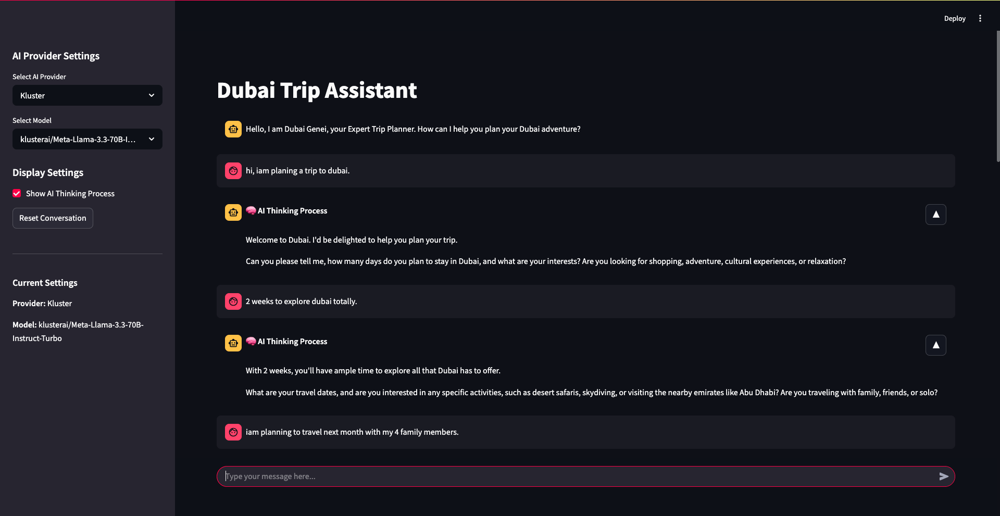
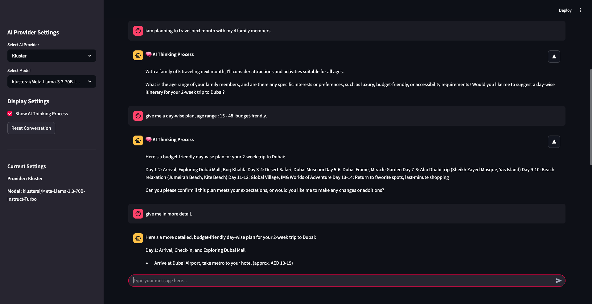

# AI-Dubai-Travel-Planner-Chatbot
AI Dubai Travel Planner Chatbot is an AI-powered chatbot that helps travelers plan trips to Dubai. It provides flight, hotel, and itinerary recommendations, visa guidance, and budget-friendly suggestions. Built with Python and Streamlit, it offers real-time travel insights for a seamless experience. 

## 🚀 Features
- AI-based travel recommendations
- Chatbot interface for user queries
- Real-time information on Dubai attractions
- Easy-to-use and customizable

## 🛠️ Installation & Setup

### **Prerequisites**
- Python 3.x installed
- OpenAI API Key (for chatbot functionality)
- LLM
- Streamlit
- Required dependencies installed

## 🛠️ Setup Instructions
### **1. Clone the Repository**
```sh
git clone https://github.com/arifzaidpp/Ai-Chatbot.git
cd Ai-Chatbot
```

### **2. Install Dependencies in **
Ensure you have Python and the required libraries installed.
```sh
pip install dotenv
pit install openai
pip install streamlit
```

### **3. Set Up Environment Variables**
Create a `.env` file and add your OpenAI API Key and other configurations:
```
OPENAI_API_KEY=your_api_key_here
```
Getting OpenAI API Key
1. Go to the OpenAI Platform.
2. Sign in or create an account.
3. Navigate to the API Keys section in the dashboard.
4. Click Create new secret key.
5. Copy the key and store it securely (you won't be able to see it again).
6. Add the key to your .env file like this:

### **4. Run the Application**
```sh
streamlit run chatbot.py
```

### **5. Access the Chatbot**
Open `http://localhost:8501/` in your browser to start using the chatbot.

## 📖 Usage
- Enter your travel details (dates, preferences, budget).
- The chatbot provides suggestions for flights, hotels, and places to visit.
- Get real-time assistance for any Dubai travel-related queries.

## 💡 Contributing
Feel free to submit pull requests or report issues to improve the project!

## 🎥 Screen Record
Watch a quick screen recording of the chatbot in action:

<video autoplay controls width="100%">
    <source src="Screenshots/video.webm" type="video/webm">
    Your browser does not support the video tag.
</video>

Click the play button above to view the demo directly.

## Screenshorts
1. Home Page

2. Chatbot




